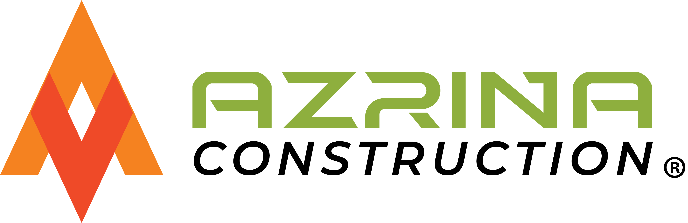

<div align="center">
  
  <h1 align="center">Sistem Informasi Manajemen Konstruksi</h1>
  
  <p align="center">
    <strong>ERP Sederhana untuk Kontraktor, Mandor, dan Manajemen Proyek</strong>
  </p>

  <p align="center">
    
    
    
    
  </p>
</div>

---

## 📖 Tentang Project
Aplikasi ini dibangun untuk membantu perusahaan konstruksi (studi kasus: **PT. Azrina Solusi Indonesia**) dalam mengelola siklus proyek, mulai dari perencanaan hingga penggajian pekerja.

Sistem ini mengatasi masalah pencatatan manual dengan mendigitalkan proses absensi harian oleh Mandor di lapangan, yang kemudian terintegrasi langsung dengan sistem penggajian otomatis berdasarkan kehadiran dan lembur.

## 🔥 Fitur Unggulan

### 1. 🏗️ Manajemen Proyek & Tim
- **CRUD Proyek:** Status (Planning, Active, Completed).
- **Penugasan Pekerja:** Assign pekerja ke proyek tertentu dengan rentang tanggal.
- **Multi-Role:** Super Admin, Admin, dan Mandor.

### 2. 👷‍♂️ Absensi Digital (Role Mandor)
- Mandor hanya bisa melihat proyek yang ditugaskan kepadanya.
- Input absensi harian (Hadir/Tidak) dan Lembur via HP.
- Validasi otomatis (hanya bisa absen di hari H).

### 3. 💰 Payroll Automation
- **Hitung Gaji Otomatis:** Berdasarkan Gaji Pokok + (Total Hadir) + (Lembur) + Tunjangan.
- **Cetak Slip Gaji:** Generate slip gaji individu atau massal (PDF/Print friendly).
- **Laporan Keuangan:** Rekapitulasi pengeluaran gaji per periode.

### 4. 📊 Dashboard Eksekutif
- Statistik kehadiran pekerja hari ini.
- Monitoring proyek yang sedang berjalan (Active).
- Notifikasi proyek mendekati deadline.

---

## 📸 Screenshots (Preview)

| Dashboard Admin | Absensi Mandor |
|:---:|:---:|
|  |  |
| *Statistik & Monitoring* | *Input Absensi Mobile Friendly* |

| Slip Gaji | Manajemen Proyek |
|:---:|:---:|
|  |  |

---

## 🛠️ Teknologi yang Digunakan

* **Backend:** Native PHP (Procedural Style & Prepared Statements untuk keamanan).
* **Database:** MySQL / MariaDB.
* **Frontend:** * **Tailwind CSS** (via CDN) untuk styling cepat & responsif.
    * **Alpine.js** untuk interaktivitas ringan (Dropdown, Sidebar).
    * **FontAwesome** untuk ikon.

---

## 📂 Struktur Folder

```text
📦 konstruksi-app
 ┣ 📂 absensi       # Modul pencatatan & rekap kehadiran
 ┣ 📂 assets        # CSS, JS, Images (Logo, Background)
 ┣ 📂 auth          # Login & Logout Logic
 ┣ 📂 gaji          # Modul perhitungan & cetak slip gaji
 ┣ 📂 includes      # Sidebar, Header, Footer, Auth Check
 ┣ 📂 jabatan       # Master data jabatan & gaji pokok
 ┣ 📂 klien         # Master data klien proyek
 ┣ 📂 pekerja       # Master data pekerja
 ┣ 📂 penugasan     # Logika assign pekerja ke proyek
 ┣ 📂 proyek        # CRUD Proyek
 ┣ 📂 users         # Manajemen user login (RBAC)
 ┣ 📜 config.php    # Koneksi Database & Base URL
 ┣ 📜 dashboard.php # Halaman utama setelah login
 ┗ 📜 index.php     # Landing Page (Company Profile)
